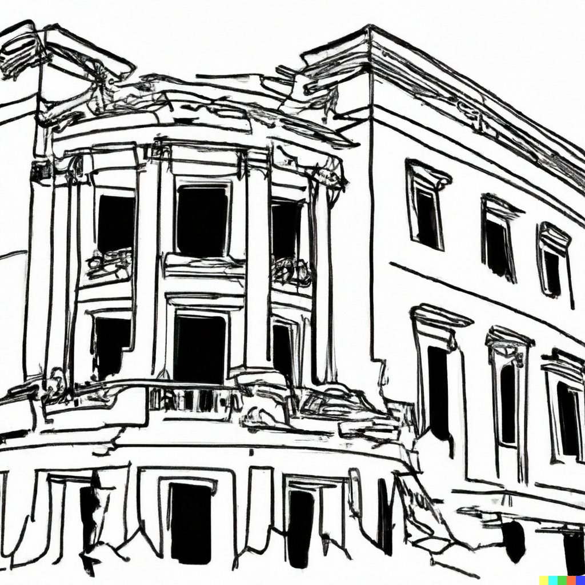

# Visual Storytelling - Kharkiv's Destroyed Infrastructure

We are documenting the destruction of Kharkiv's city center – universities, museums, religious sites, residential apartment buildings, etc. Albeit digitally, we want to emulate the experience of walking through the city.

## Data

The research combines testimonies, on-site damage assessments, videos of the shelling incident, before/after pictures, and satellite imagery.

### Building Damage Assessment 

Our [damage assessment questionnaire](./data/damage-assessments/questionnaire.pdf) is based on two publications by UN-Habitat and was reviewed by a civil engineer. 
 
 - [Beirut Municipality Rapid Building-Level Damage Assessment](https://unhabitat.org/beirut-port-explosions-response-beirut-municipality-rapid-building-level-damage-assessment) 
 - [People’s Process in Post-disaster and Post-Conflict Recovery and Reconstruction](https://unhabitat.org/people%E2%80%99s-process-in-post-disaster-and-post-conflict-recovery-and-reconstruction)

### Before/After Pictures

Pictures were taken on-site between July 12th, 2022 and July 13th, 2022. 

### Testimonies

Testimonies are sourced from research conducated by journalists and international NGOs. 

 - [Anyone can die at any time, Amnesty International](https://www.amnesty.org/en/latest/research/2022/06//)

### Videos

Videos of the shelling incidents were sourced from news outlets, social media and war crime observers.

 - [War Evidence](https://war-evidence.mkip.gov.ua/)

### Landmarks

The [landmarks](./landmarks.geojson) selected were from news reports and observers. 

 - [UNESCO](https://www.unesco.org/en/articles/damaged-cultural-sites-ukraine-verified-unesco)
 

### Satellite Imagery

Satellite imagery of Kharkiv's city center is provided by [Planet](https://www.planet.com/) as part of their [Disaster Data Programme](https://www.planet.com/disasterdata/). Here are some basic details about the instrumentation, 

| | |
| --- | --- |
| Source | [SkySat Collect](https://developers.planet.com/docs/data/skysatcollect/) |
| Ground Sampling Distance | 0.7m |
| Pixel Resolution | 0.5m |

## Authors

- [Jean-Romain Roy](https://jeanromainroy.com/)

- [Emmanuel Roy](https://manuroy.ca/)
